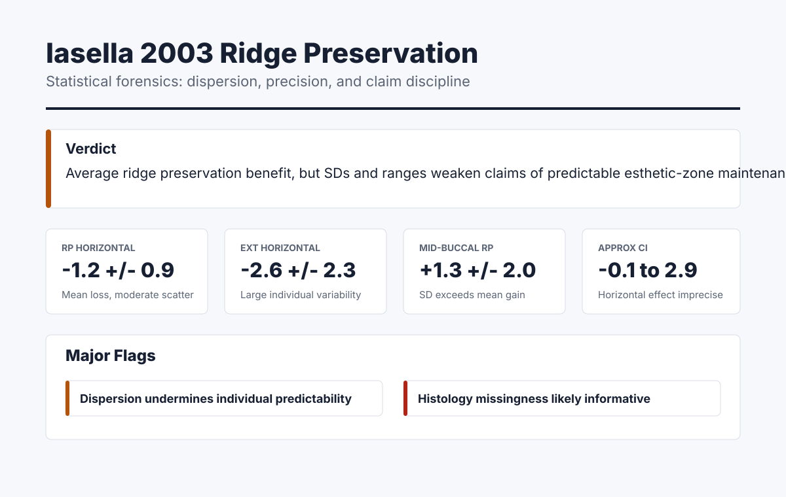

# Dental AI Skills

**Structured AI protocols for dentists, researchers, and dental educators.**

Drop these into Claude Desktop, Claude Code, ChatGPT, or any AI that accepts custom instructions — and get specialist-level output instead of generic responses.

[](LICENSE)

---

## What's Inside

| Skill | Who It's For | What It Does |
|-------|-------------|--------------|
| [**Research Critic**](research-critic/) | Researchers & PhD students | Single-paper appraisal: PICO extraction → bias tool selection (RoB 2 incl. cluster/crossover/split-mouth, ROBINS-I, QUADAS-3, AMSTAR 2, Newcastle-Ottawa, JBI, ARRIVE+SYRCLE, CRIS) → dental red flags → claim-to-evidence map → Study Credibility score |
| [**Clinical Evidence Reviewer**](clinical-evidence-reviewer/) | Clinicians | Body-of-evidence reviews: runtime-aware retrieval mode, PICO, GRADE certainty **per critical outcome**, guideline-vs-consensus distinction, patient selection, "what's unknown" |
| [**Dental Evidence Retriever**](dental-evidence-retriever/) | Researchers, clinicians | Literature search workflow: PICO → PubMed/Cochrane/guideline-body/ClinicalTrials.gov/PROSPERO strategies → retrieval log. Honest about runtime — no fabricated citations |
| [**Dental Statistical Forensics**](dental-statistical-forensics/) | Researchers, reviewers | Deep numerical audit: SD/range, CIs, effect sizes, MCID, individual predictability, unit-of-analysis errors, clustering, multiplicity, missing data, model appropriateness, measurement reliability, and claim-to-number discipline |
| [**Dental Evidence Report Artifact**](dental-evidence-report-artifact/) | Educators, researchers | Turns completed critiques, evidence reviews, retrieval logs, and statistical audits into polished HTML/PDF-ready reports without adding new evidence claims |
| [**Dental Content Creator**](dental-content-creator/) | Educators & marketers | Audience-aware content with platform adaptations (LinkedIn/X/Instagram), no-overclaim guardrails, evidence-backed mode |
| [**Dental Image Generator**](dental-image-generator/) | Anyone creating visuals | AI clinical illustrations via Google Gemini — surgical diagrams, patient infographics, branded content |

**Scientific-literature workflow.** The four literature skills are designed to work together:

```
Question → dental-evidence-retriever  →  body of evidence → clinical-evidence-reviewer
            (search strategy + log)                          (GRADE per outcome, guidelines, recommendations)
                                      ↘ numerical disputes → dental-statistical-forensics
                                        (effect size, SD/range, CI, MCID, model validity)

Single paper to appraise → research-critic → dental-statistical-forensics
                            (single-paper credibility)         (numbers and predictability audit)

Completed analysis → dental-evidence-report-artifact
                     (HTML/PDF-ready report, teaching handout, journal-club artifact)
```

`research-critic`, `clinical-evidence-reviewer`, `dental-evidence-retriever`, `dental-statistical-forensics`, and `dental-evidence-report-artifact` hand off to each other automatically when a question belongs in another layer of the workflow.



---

## Installation

### Option A: Claude Desktop (Non-Technical)

1. **Download:** Click the green "Code" button above → "Download ZIP"
2. **Unzip** the folder anywhere on your computer
3. **Open Claude Desktop** → Settings (gear icon) → Projects
4. **Create a new project** called "Dental AI Skills"
5. **Add the `SKILL.md` files** from the skill folders you want to use
6. **Start a conversation** inside that project — done!

> **Tip:** If Claude doesn't follow the protocol, start your prompt with: *"Following the Research Critic protocol, critique this study..."*

### Option B: Claude Code (Terminal)

Claude Code supports two install scopes:

| Scope | Path | Applies to |
|---|---|---|
| **Personal** | `~/.claude/skills/<skill-name>/SKILL.md` | All your projects |
| **Project** | `<project>/.claude/skills/<skill-name>/SKILL.md` | One project only |

```bash
# Clone the repo
git clone https://github.com/Tuminha/dental-ai-skills.git
cd dental-ai-skills

# Option 1 — Personal install (recommended; available everywhere)
mkdir -p ~/.claude/skills
cp -r research-critic ~/.claude/skills/
cp -r clinical-evidence-reviewer ~/.claude/skills/
cp -r dental-evidence-retriever ~/.claude/skills/
cp -r dental-statistical-forensics ~/.claude/skills/
cp -r dental-evidence-report-artifact ~/.claude/skills/
cp -r dental-content-creator ~/.claude/skills/
cp -r dental-image-generator ~/.claude/skills/

# Option 2 — Project install (scoped to one repo)
mkdir -p your-project/.claude/skills
cp -r research-critic your-project/.claude/skills/
cp -r clinical-evidence-reviewer your-project/.claude/skills/
cp -r dental-evidence-retriever your-project/.claude/skills/
cp -r dental-statistical-forensics your-project/.claude/skills/
cp -r dental-evidence-report-artifact your-project/.claude/skills/
cp -r dental-content-creator your-project/.claude/skills/
cp -r dental-image-generator your-project/.claude/skills/
```

If you only want the scientific-literature workflow for a given project, install the first five.

Claude Code reads the YAML frontmatter and auto-loads each skill when its description matches your prompt. You can also invoke any skill directly: `/research-critic`, `/clinical-evidence-reviewer`, `/dental-evidence-retriever`, `/dental-statistical-forensics`, `/dental-evidence-report-artifact`.

### Option C: ChatGPT / claude.ai / Other AI Platforms

1. Open the `SKILL.md` file for the skill you want.
2. Copy the full contents.
3. In ChatGPT: Settings → Personalization → Custom Instructions → paste.
4. In claude.ai: Projects → Custom Instructions → paste.
5. In other platforms: use whatever "custom instructions" or "system prompt" mechanism is available.

The skills are plain markdown — they work anywhere that accepts text instructions.

### Portability note: how the YAML frontmatter behaves across surfaces

| Surface | Frontmatter fields read | Network access | Notes |
|---|---|---|---|
| **Claude Code** | `name`, `description`, `when_to_use`, `effort`, `allowed-tools`, etc. (full Skills spec) | Full (via your machine) | Auto-discovery uses `description` + `when_to_use` to match prompts. `clinical-evidence-reviewer` and `dental-evidence-retriever` can perform real retrieval here. |
| **claude.ai (Projects)** | Skill body is read; frontmatter is generally ignored or absorbed as context | Browsing varies by plan | Skills still work because the body is self-sufficient. Retrieval may or may not be possible — the retrieval-mode block handles this. |
| **Claude API (Agent Skills)** | `name`, `description` (per the Agent Skills spec); other fields ignored | **No network by default** | Skills are pure instructions. `clinical-evidence-reviewer` will branch into "no live retrieval" mode and demand verified or labeled citations. |
| **ChatGPT custom instructions** | Frontmatter ignored — only the body matters | Browsing if enabled | Same as above; the body is self-sufficient. |

The skills are designed so the *body* is the contract. YAML frontmatter improves Claude Code ergonomics but is not required for the skill to work elsewhere.

### Option D: Image Generator (Requires Python)

```bash
cd dental-image-generator
pip install -r requirements.txt
export GEMINI_API_KEY="your-key-from-aistudio.google.com/apikey"
python scripts/generate_dental_image.py --prompt "Your description" --style clinical --output image.png
```

---

## Skills in Detail

### Research Critic

The peer reviewer you wish you had. Feed it a single paper and get:

- **Mandatory Phase 0 extraction first** — PICO, study classification (including randomization structure), unit of analysis, design essentials checklist — before any critique.
- **Correct bias tool, in its native format** — auto-selects RoB 2 (with cluster, crossover, and split-mouth variants), ROBINS-I, QUADAS-3 (preferred; QUADAS-2 only for legacy), AMSTAR 2 (using its native High/Moderate/Low/Critically Low confidence — not a fake score), Newcastle-Ottawa (star system), JBI, ARRIVE 2.0 + SYRCLE for animal, CRIS for in-vitro dental.
- **Unit-of-analysis audit** — patient / implant / tooth / site / surface levels, flags hierarchical-clustering mistakes.
- **Dental-specific red flags** — split-mouth clustering, success vs survival conflation, 2017 World Workshop definitions, short follow-up sold as long-term, implant-level vs patient-level mismatch, examiner calibration, radiographic standardization.
- **Statistical Forensics Triage** — forces SD/range, CI, MCID, individual-predictability, multiplicity, missing-data, and model-appropriateness checks before the paper's numerical claims are accepted.
- **Claim-to-evidence mapping** — checks every Discussion claim against the actual results.
- **Study Credibility score** (renamed from "Overall Evidence Quality") — 0–3 per domain, total /18. High credibility ≠ "strong evidence for clinical use"; that's a body-of-evidence question and hands off to `clinical-evidence-reviewer`.
- **Actionable output** — fatal flaws (up to 5, not forced), fixable issues, what would be needed to trust the study.

### Clinical Evidence Reviewer

Evidence-graded decision support, body-of-evidence and outcome-centric:

- **Evidence Retrieval Mode block** — declares runtime (Claude Code / claude.ai / API / unknown), whether live search is possible, what sources were searched. Prevents hallucinated citations in no-network runtimes.
- **PICO before synthesis** — pins population, intervention, comparator, outcomes, setting, time horizon.
- **GRADE certainty per critical outcome** — survival, marginal bone level change, biological complications, aesthetics (PES/WES), patient-reported, retreatment, adverse events. Not a single global rating.
- **Guideline-vs-consensus distinction** — evidence-based guidelines (EFP S3, ADA EBD) are reported with methodology + strength + certainty as stated by the guideline. Pure expert consensus stays at Level V.
- **Strict citation policy** — every clinical claim cites DOI/PMID/guideline document or carries an explicit uncertainty label.
- **Currency check** — ✅ Current / ⚠️ Aging / 🔴 Outdated. Older sources are not automatically outdated.
- **Patient selection, failure modes, what's unknown.**
- **Hand-off to `research-critic`** when the user asks a single-paper question, and to `dental-evidence-retriever` when the literature has not been searched yet.

### Dental Evidence Retriever

Literature-search workflow for dental clinical questions:

- **Runtime-honest** — declares whether live retrieval is possible and never fabricates results.
- **PICO → search strategy** for PubMed (MeSH + free-text), Cochrane CENTRAL, EFP/AAP/EAO/ITI/ADA/NICE/AAOMS guideline repositories, ClinicalTrials.gov, PROSPERO.
- **Retrieval log** — reproducible Boolean queries, date, result counts, per-source status — that `clinical-evidence-reviewer` can consume directly.
- **Hand-off** to `clinical-evidence-reviewer` (for grading), `research-critic` (for single-paper appraisal), and `dental-statistical-forensics` (for numerical audit).

### Dental Statistical Forensics

The numbers reviewer. Use it when the mean looks good but the SD, CI, MCID, missing data, clustering, or model choice may change the interpretation:

- **Core numerical audit** — outcome type, unit of analysis, effect estimate, precision, dispersion, clinical threshold, individual predictability, sample size, missing data, multiplicity, model appropriateness, claim discipline.
- **Dispersion and predictability lens** — explicitly asks whether SD / IQR / range undermine claims like "predictable," "clinically reliable," or "maintains esthetics."
- **Clinical threshold discipline** — compares effect size against MCID, failure thresholds, and measurement error instead of accepting p-values alone.
- **Dental hierarchy checks** — patient / implant / tooth / site / surface / sinus / scan / histologic-field clustering.
- **Domain modules** — ridge preservation and esthetic zone, sinus lift, periodontal treatment, implant outcomes, diagnostic accuracy, digital dentistry, and meta-analysis.
- **Claim-to-number discipline** — separates average treatment effects from individual-patient reliability and flags overinterpretation.
- **Deterministic helper** — `scripts/stats_forensics_calculator.py` can compute screening CIs, SD/effect ratios, binary effect measures, and diagnostic likelihood ratios without third-party packages.

### Dental Evidence Report Artifact

Turns completed analysis into polished HTML/PDF-ready reports:

- **Separation of analysis and presentation** — formats completed outputs from `research-critic`, `clinical-evidence-reviewer`, `dental-evidence-retriever`, or `dental-statistical-forensics`; it does not invent evidence.
- **Standalone HTML template** — restrained clinical styling, metric cards, severity flags, sections, and source tables.
- **Renderer script** — `scripts/render_evidence_report.py` converts compact JSON into an HTML report.
- **Example artifact** — see [`examples/iasella-statistical-forensics-report.html`](examples/iasella-statistical-forensics-report.html) and the source JSON in [`examples/iasella-statistical-forensics-report-data.json`](examples/iasella-statistical-forensics-report-data.json).

### Dental Content Creator

Content that sounds professional, not AI-generated:

- **Audience modes** — adjusts tone, depth, and jargon for GPs, specialists, students, patients, or industry
- **Evidence-backed mode** — clinical claims cite sources (default for professional audiences)
- **Full content bundle** — main piece + LinkedIn + X/Twitter + Instagram + 5 hooks + CTA variants
- **No-overclaim guardrails** — no absolute outcome claims, no unsourced brand comparisons, case-selection caveats required

### Dental Image Generator

AI-generated clinical visuals:

- **Three style presets** — clinical (textbook), patient-friendly (calming), infographic (modern)
- **Brand extraction** — analyzes your clinic's logo/brochure and matches the style
- **Prompt cookbook** — tested prompts for surgical diagrams, patient handouts, social media graphics
- **Google Gemini** — free tier (15 req/min), no design skills needed

---

## Troubleshooting

**"The AI isn't following the skill protocol."**
Start your prompt with the skill name: *"Using the Research Critic protocol, analyze..."* If that doesn't help, check that the SKILL.md is loaded in your project (not just mentioned in the chat).

**"Output looks generic, not specialized."**
Make sure you're working inside the project/conversation where the skill is loaded. In Claude Desktop, conversations outside the project don't have access to project knowledge files.

**"It's citing studies that don't exist."**
AI models can hallucinate citations. The Clinical Evidence Reviewer requires an Evidence Retrieval Mode block at the top of every response so you can immediately tell whether the citations come from a live search or from recalled memory. If retrieval was not possible, the skill must label recalled DOIs/PMIDs as `[Recalled citation — verify before use]`. Always verify DOIs before clinical or publication use. Ask: *"Verify this citation — is it real?"*

**"Can I use more than one skill at once?"**
Yes. Add multiple SKILL.md files to the same project. The AI will use whichever is relevant to your prompt. For best results with multiple skills, name the one you want in your prompt.

**"How do I check that Claude Code can parse the skills?"**
Run the included validator from the repo root:

```bash
python3 scripts/validate_skills.py
```

It checks every `*/SKILL.md` for YAML frontmatter and required metadata.

For the full repo smoke test, including `agents/openai.yaml`, examples, fixtures, and helper scripts:

```bash
python3 scripts/smoke_test_repo.py
```

---

## Testing

See [TESTING.md](TESTING.md) for manual test prompts and structural checks for each skill. The `fixtures/` folder includes compact regression fixtures for high-SD / individual-predictability, split-mouth clustering, QUADAS-3 diagnostic accuracy, AMSTAR 2 native judgment, implant survival-vs-success, and periodontal site-level clustering.

---

## About

Created by **[Francisco Teixeira Barbosa](https://periospot.com)** — periodontist, dental tech enthusiast, and founder of [Periospot](https://periospot.com).

These skills are opinionated by design. They enforce structured extraction before judgment, require citations or uncertainty labels, and include dental-specific checks that generic AI prompts miss.

**Newsletter:** [The Periospot Brew](https://periospot.com) — weekly AI + dentistry insights.

## License

MIT — use these however you want. If they help your research or practice, a star is appreciated.

---

*Built by [Periospot](https://periospot.com)*
